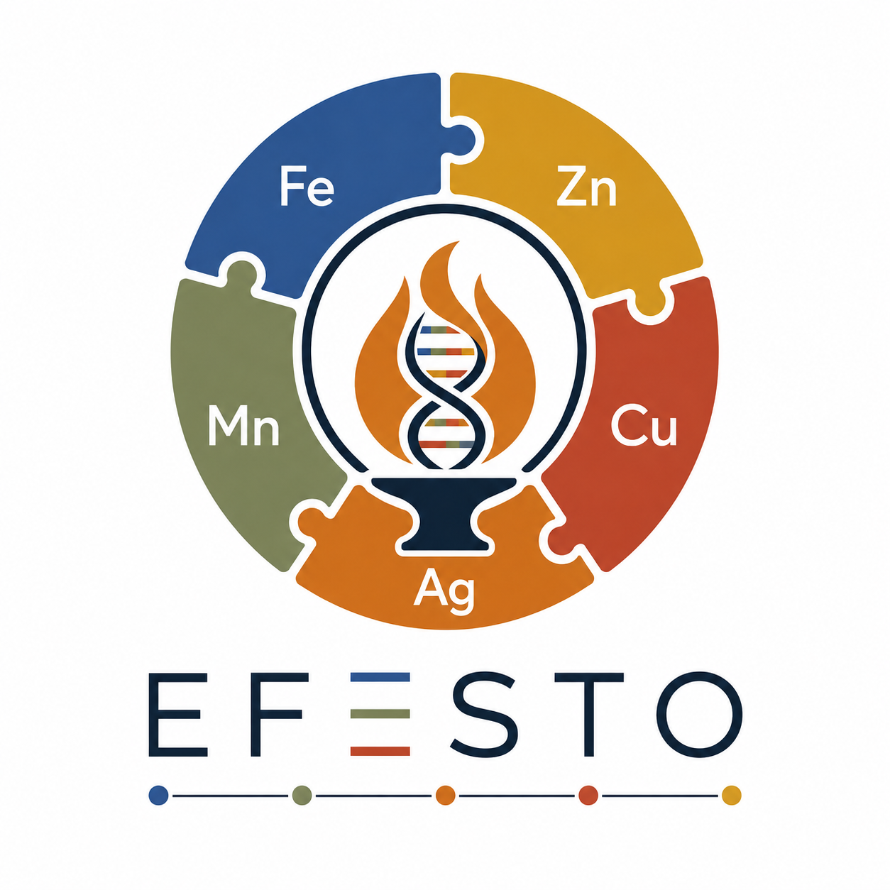

# Efesto

<p align="center">
  
</p>

**Efesto** extends [FeGenie](https://github.com/Arkadiy-Garber/FeGenie) with coordinate-based operon clustering, a cluster confidence scoring system, an expanded curated HMM library (iron cycling + metal resistance), and integration with UniOP, antiSMASH, and Anvi'o.

📖 **[Full documentation → Wiki](https://github.com/l-gallucci/Efesto/wiki)**

---

## Citations

If you use Efesto, cite all of the following that apply:

**FeGenie** (iron cycling HMMs and operon logic):
> Garber AI et al. (2020) *FeGenie: A Comprehensive Tool for the Identification of Iron Genes and Iron Gene Neighborhoods.* Front. Microbiol. 11:37. [doi:10.3389/fmicb.2020.00037](https://doi.org/10.3389/fmicb.2020.00037)

**MetHMMDB** (metal resistance gene HMMs):
> Kciuchcinski K et al. (2025) *Fast and accurate detection of metal resistance genes using MetHMMDB.* bioRxiv. [doi:10.1101/2024.12.26.629440](https://doi.org/10.1101/2024.12.26.629440)

**Tabuteau et al.** (additional iron acquisition HMMs):
> Tabuteau S et al. (2025) *Metagenomic profiling and genome-centric analysis reveal iron acquisition systems in cheese-associated bacteria and fungi.* Environmental Microbiology 27(12):e70218. [doi:10.1111/1462-2920.70218](https://doi.org/10.1111/1462-2920.70218)

**KOfam** (KEGG Ortholog HMMs used in Tabuteau et al.):
> Aramaki T et al. (2020) *KofamKOALA: KEGG Ortholog assignment based on profile HMM and adaptive score threshold.* Bioinformatics 36:2251–2252. [doi:10.1093/bioinformatics/btz859](https://doi.org/10.1093/bioinformatics/btz859)

**NCBI Protein Family Models** (NF* HMMs):
> Li W et al. (2021) *RefSeq: expanding the Prokaryotic Genome Annotation Pipeline reach with protein family model curation.* Nucleic Acids Research 49:D1020–D1028. [doi:10.1093/nar/gkaa1105](https://doi.org/10.1093/nar/gkaa1105)

**UniOP** (operon prediction, if using `--operon_prediction`):
> Su H, Zhang R, Söding J (2024) *UniOP: a universal operon prediction for high-throughput prokaryotic (meta-)genomic data.* bioRxiv. [doi:10.1101/2024.11.11.623000](https://doi.org/10.1101/2024.11.11.623000)

---

## Installation

```bash
git clone https://github.com/l-gallucci/Efesto.git
cd Efesto
mamba env create -f environment.yml
conda activate efesto
efesto --help
```

→ [Full installation guide](https://github.com/l-gallucci/Efesto/wiki/installation) including UniOP setup and manual install options.

---

## Quick start

```bash
# From Prodigal FAA files
efesto --faa_dir orfs/ --hmm_dir hmm_library/ --out results/

# From nucleotide assemblies (Prodigal internal)
efesto --fna_dir assemblies/ --meta --hmm_dir hmm_library/ --out results/ --threads 16

# Full confidence scoring (UniOP + antiSMASH)
efesto \
    --faa_dir           orfs/ \
    --gff_dir           gff/ \
    --hmm_dir           hmm_library/ \
    --out               results/ \
    --threads           16 \
    --operon_prediction \
    --uniop_path        /path/to/UniOP/src/UniOP \
    --bgc_dir           antismash_output/
```

→ [Full usage guide](https://github.com/l-gallucci/Efesto/wiki/output_formats) · [All arguments](https://github.com/l-gallucci/Efesto/wiki/installation)

---

## HMM library

466 active models across 4 sources: FeGenie (196), Tabuteau et al. (130), MetHMMDB (115), NCBIfam (15). Categories span iron oxidation, reduction, storage, regulation, stress, Fe-S assembly, siderophore synthesis/transport, heme acquisition, and broad metal resistance.

→ [HMM library documentation](https://github.com/l-gallucci/Efesto/wiki/hmm_library)

---

## Differences from FeGenie at a glance

| Feature | FeGenie | Efesto |
|---|---|---|
| Operon clustering | ORF ordinal index | **bp coordinates (GFF)** + ordinal fallback |
| Per-rule bp-gap tuning | No | **Yes (`max_bp_gap` per operon rule)** |
| Strand awareness | No | **Yes (`--strand_aware`)** |
| Parallelism | Sequential | **ProcessPoolExecutor** |
| Operon filter logic | Hardcoded Python | **Exact port + JSON override** |
| Result caching | No | **Yes (tblout cache)** |
| MetHMMDB support | No | **Yes** |
| Additional iron HMMs | No | **Yes (Tabuteau et al. 2025)** |
| HMM deduplication | No | **Yes (sequence-level, cross-source)** |
| Versioned HMM registry | No | **Yes (`hmm_registry.tsv`)** |
| Cluster confidence score | No | **Yes (HMM × co-occ × UniOP × BGC)** |
| GFF3 output | No | **Yes (auto when coordinates available)** |
| Summary statistics | No | **Yes (`Efesto-summary-stats.tsv`)** |
| antiSMASH BGC boost | No | **Yes (`--bgc_dir`)** |
| Coverage heatmap | `--bam` | **`--bam` / `--bams` / `--depth` / `--depths`** |
| Coverage normalisation | No | **TPM (`--norm_coverage`)** |
| Integrated Prodigal | No | **Yes (`--fna_dir --meta`)** |
| Contig length filter | No | **Yes (`--min_contig_len`)** |
| Long-format output | No | **Yes (`results-long.tsv` with all scoring columns)** |
| Operon prediction | No | **Yes (UniOP, `--operon_prediction`)** |
| Anvi'o integration | No | **Yes (functions + gene-scores TSVs)** |
| R script compatibility | Yes | **Yes (same CSV format)** |
| FeGenie filter rules | All | **All (exact port)** |

---

## License

MIT License. See [LICENSE](LICENSE).

Efesto is not affiliated with the original FeGenie authors.
